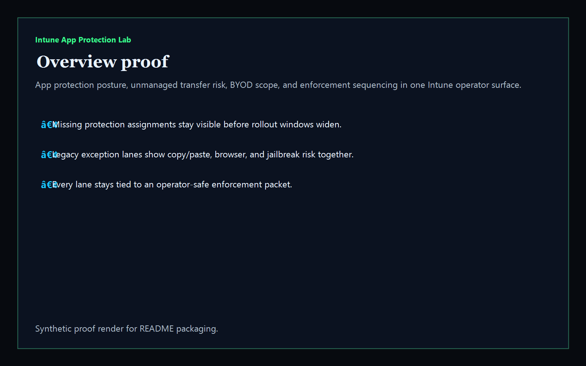
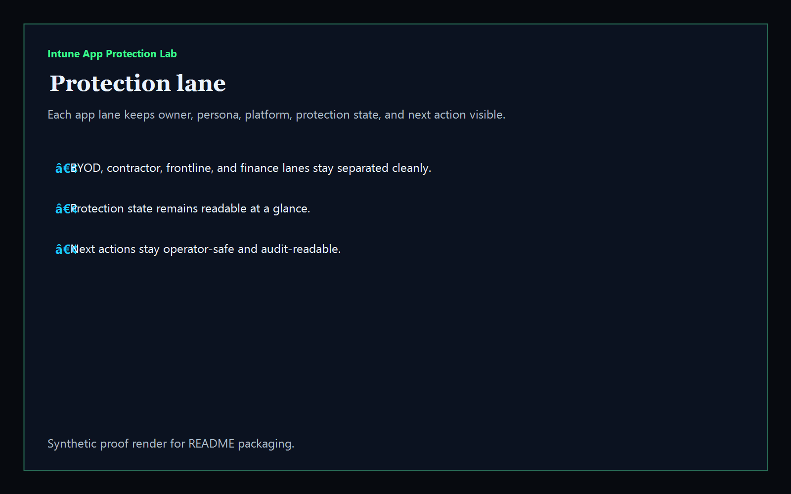
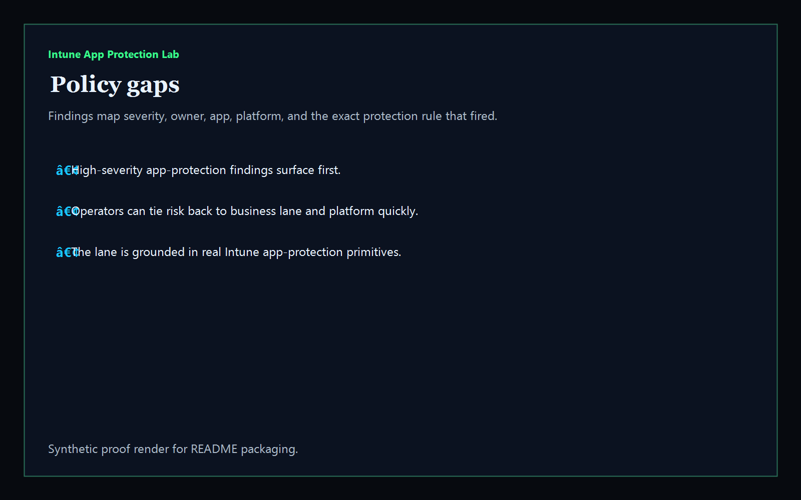
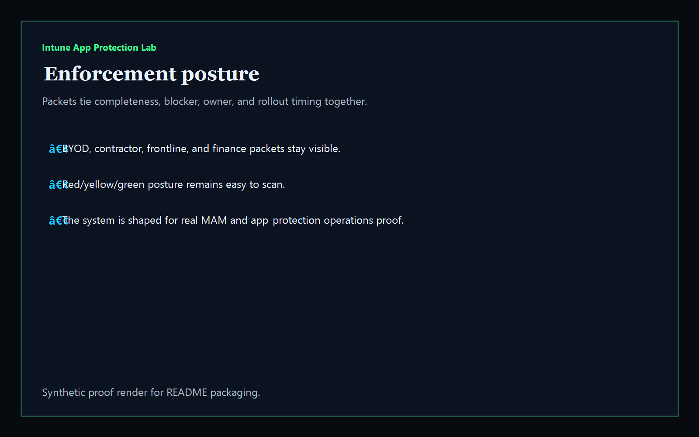

# Intune App Protection Lab

[](https://github.com/mizcausevic-dev/intune-app-protection-lab/actions/workflows/ci.yml)
[](./LICENSE)
[](https://github.com/mizcausevic-dev/intune-app-protection-lab/actions/workflows/pages.yml)

Operator control plane for Microsoft Intune app protection, unmanaged transfer risk, BYOD scope, managed-browser posture, and enforcement readiness across mobile app lanes.

## Why this matters (KG Embedded tie-back)

- Intune app-protection posture usually lives in policy screens, rollout notes, and exception threads instead of one buyer-readable operating surface.
- Security and workplace-platform teams need to see which app lanes are missing policy coverage, which exceptions still allow data escape, and which rollout lanes are safe to expand.
- This Kinetic Gain operator surface turns synthetic MAM-style packets into app-lane, policy-gap, and enforcement views that can later be embedded inside a tenant-safe Microsoft admin product.

## What it includes

- app-protection lane visibility for active Intune MAM / BYOD / contractor routes
- policy-gap review across missing assignments, unmanaged transfer controls, stale sync, and rooted-device exposure
- enforcement packets for rollout timing and exception cleanup
- offline-safe analysis of captured app-protection assignment packets
- library + CLI + Express operator surface + static Pages deploy

## Routes

- `/`
- `/protection-lane`
- `/policy-gaps`
- `/enforcement-posture`
- `/verification`
- `/docs`

## API

- `/api/dashboard/summary`
- `/api/protection-lane`
- `/api/policy-gaps`
- `/api/enforcement-posture`
- `/api/verification`
- `/api/sample`

## Screenshots






## CLI

```powershell
npx intune-app-protection .\fixtures\app-protection.json --format markdown
```

Optional flags:

- `--format json|markdown|summary`
- `--now <iso>`
- `--stale-after-days <n>`
- `--fail-on-high`
- `--out <file>`

## Local run

```powershell
cd intune-app-protection-lab
npm install
npm run verify
npm run prerender
npm run render:assets
npm run dev
```

Then open:

- [http://127.0.0.1:5512/](http://127.0.0.1:5512/)
- [http://127.0.0.1:5512/protection-lane](http://127.0.0.1:5512/protection-lane)
- [http://127.0.0.1:5512/policy-gaps](http://127.0.0.1:5512/policy-gaps)
- [http://127.0.0.1:5512/enforcement-posture](http://127.0.0.1:5512/enforcement-posture)

## Live surface

- [https://protect.kineticgain.com/](https://protect.kineticgain.com/)

## Synthetic-data note

This repo publishes synthetic sample app-protection data only. It does not ship live tenant exports, Graph tokens, or authenticated write paths.
